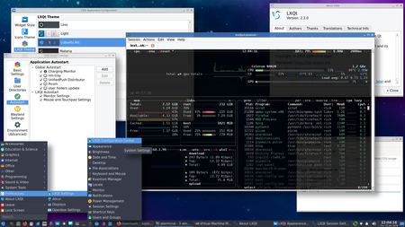
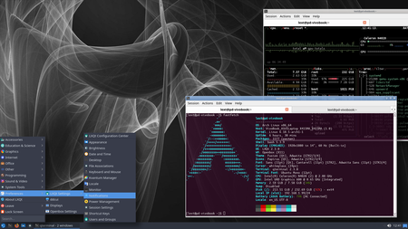

# lext-theme-lubuntu-arc
Install the **Lubuntu Arc** *LXQt desktop theme* (as used by Lubuntu) on **Arch Linux**.

### Some screenshots
<p>
  <a href="screenshots/full1.png">
    
  </a>
  &nbsp;&nbsp;&nbsp;
  <a href="screenshots/full2.png">
    
  </a>
</p>

The screenshots above apply to traditional **X11** server, with the classic ***Application Menu*** widget, and not the ~~very ugly~~ totally different *Fancy Menu* widget. That recent ~~enhancement~~ addition is *by default* installed in **lxqt-panel** since LXQt is striving to be Wayland compatible. Fortunately for me, the original menu widget is still available, and easily selected. Even under Wayland. Unfortunately, it renders ~~strangely~~ incorrectly with most Wayland *compositors*. Behaviour with the KDE Plasma compositor is acceptable though. 

The samples use ***openbox*** and ***picom***. Openbox is good enough, and easily interchanged with another X11 window manager if desired. Picom gives nice shades to the windows, and also offers transparency. I restrict transparency exclusive to ***Qterminal*** only. Although *Qterminal* has a setting for it, it may not work for all *backends*. In that case *picom* should be able to provide it. The configuration thereof is a bit ~~complicated~~ tricky. Your favourite *AI* agent is able to help.

### Installation
This theme is available on AUR (for Arch Linux): 
```bash
$ yay -S lext-theme-lubuntu-arc
```
#### Arch Linux without AUR helper
If you don't have an AUR helper like *yay* installed:
```bash
$ git clone https://github.com/lext-next/lext-theme-lubuntu-arc
$ cd lext-theme-lubuntu-arc
$ makepkg -si
```
Optionally followed by: 
```bash
$ cd ..
$ rm -Rf lext-theme-lubuntu-arc 
```

### What is this?
This repository is intended for use with AUR (for Arch Linux and derived systems). There is already a package 'lubuntu-artwork' in the AUR that's supposed to install the Lubuntu-Arc theme as well. Mentioned package has a problem. If the LXQt team publishes a new version, installation on Arch Linux fails until *moi* fixes the *PKGBUILD* file. Besides it is 'bulky' since it contains all of the artwork (including various large wallpaper files). 

This AUR package (*lext-theme-lubuntu-arc) contains only what is needed, and depends not on an *upstream* server. Twice a year a new version (which reflects the latest Lubuntu release) is published by *upstream*. I'll try to keep up with it. But, if unnoticed, the former AUR package will fail. Tendency is that only few changes have been made in the recent years. Recently mostly due to the introduction of said *Fancy Menu* widget. 

### Disclaimer
The actual *AUR* components (PKGBUILD etc.) are not in this repository (i.e. the one which you are looking at right now). That part resides on the AUR website. The contents required by AUR also does not live in this repository. As with every website you visit, the use of the *lext-theme-lubuntu-arc* package is subject to possible monitoring in any form, and you should decide if you want to leave your footprint *before installing*.

### Credits
This AUR package is just cleanup of the original theme as provided by the **Lubuntu** team, ready to go for Arch Linux (mostly for my own ease of install). Just stripped down a bit, nothing more, nothing special. 

**Kudos to the original theme creator(s) of the theme!** 

I ripped the black and white background (the *wow5-*image) from the **Razor-qt** project archives. In 2015 Razor-qt pioneered with a Qt based desktop, which eventually would merge with LXDE to form LXQt.  

### Wishlist
+ I really could appreciate if my highly valued **LXQt**-team (or perhaps my even highly appreciated **Arch Linux** group of LXQt maintainers) would *ask* during the installation of *lxqt-panel* which menu widget should be applied;
+ I really would like to get my hands on the code of the generator that produced the above mentioned *wow5* image.

